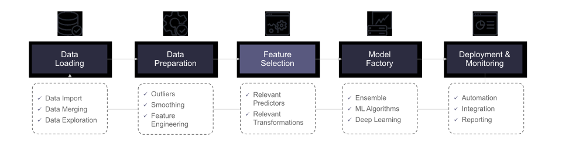
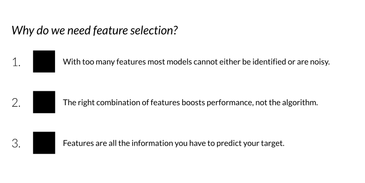
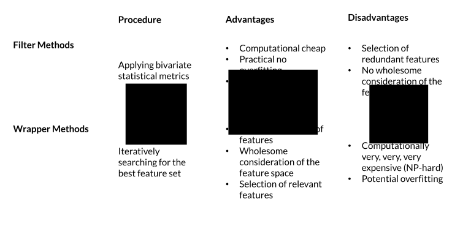
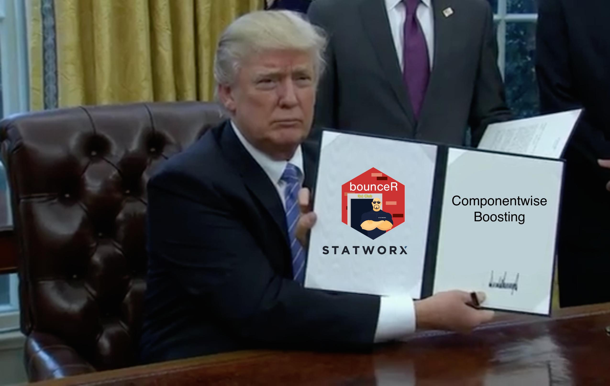
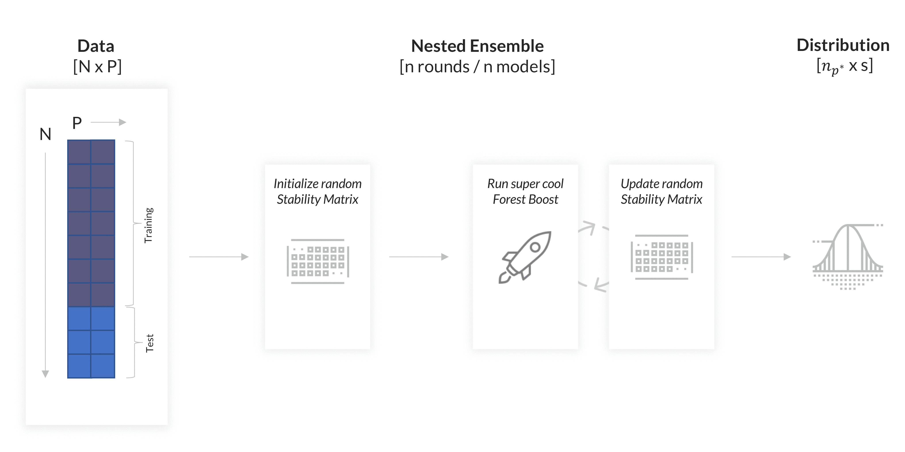
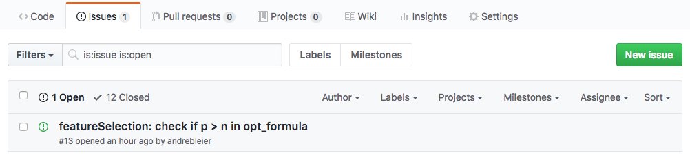

<style>
.header {
    color: black;
    position: fixed;
    top: 5%;
    text-align: right;
    width: 100%;
}
.heading {
    color: black;
    position: fixed;
    top: 20%;
    left: 0%;
    text-align:center;
}
.hexatitle {
    position: fixed;
    top: 45%;
    left: 32%;
}
.authortitle {
    color: black;
    position: fixed;
    top: 60%;
    left: 55%;
    text-align:left;
}
.gif_insert {
    position: fixed;
    top: 30;
    left: 20;
}
.bouncer_gif {
    position: fixed;
    top: 25%;
    left: 20%;
}
.clients_insert {
    position: fixed;
    top: 21%;
    left: 60%;
}
.technology_insert {
    position: fixed;
    top: 75%;
    left: 60%;
}
.workflow {
    position: fixed;
    top: 25%;
    left: 10%;
}
.issues {
    position: fixed;
    top: 62%;
    left: 7%;
}
.trump {
    position: fixed;
    left: 20%;
    top: 20%;
}
.reveal pre code {
  font-size: 1.4em;
}

.reveal h3 {
  word-wrap: normal;
  -moz-hyphens: none;
}
.reveal h1 {
  word-wrap: normal;
  -moz-hyphens: none;
}
.pinky .reveal .state-background {
  background: #FF69B4;
} 

 body {
      background-image: url(figures/background.png);
      background-position: center center;
      background-attachment: fixed;
      background-repeat: no-repeat;
      background-size: 100% 100%;
    }
.section .reveal .state-background {
    background-image: url(figures/background.png);
    background-position: center center;
    background-attachment: fixed;
    background-repeat: no-repeat;
    background-size: 100% 100%;
}

</style>


========================================================
transition: rotate
transition-speed: slow
height: 900
width: 1600
title: false

  <div class="heading" style="margin-left:30px">
  <SPAN STYLE="font-size:180%;">
  <code>bounceR</code>:
  </SPAN>
  <SPAN STYLE="font-size:130%;color=black;">
  Automated Feature Selection for Machine Learning Algorithms
</SPAN>
  </div>
  
  <div class="authortitle" style="margin-left:0px;color=black;">
  <SPAN STYLE="font-size:80%;">
  Lukas Jan Stroemsdoerfer
</SPAN><br>
  <SPAN STYLE="font-size:80%;">
  Data Scientist @STATWORX
</SPAN>
  </div>
  
  
  <div class="hexatitle">
  <div style="margin-right:0px;margin-top:0px;">
  </img>
  </div>
  </div>

About STATWORX
========================================================

We are a consulting company for data science, machine learning and statistics with offices in Frankfurt, Zurich and Stuttgart. We support our customers in the development and implementation of data science and machine learning solutions.

<div class="gif_insert">
  <div style="margin-right:0px;margin-top:0px;">
    </img>
  </div>
</div>

<div class="clients_insert">
  <div><SPAN STYLE="font-size:70%;">Our clients:</SPAN></div>
  <div style="margin-right:0px;margin-top:0px;">
    </img>
  </div>
</div>

<div class="technology_insert">
  <div><SPAN STYLE="font-size:70%;">Our expertise:</SPAN></div>
  <div style="margin-right:0px;margin-top:0px;">
    </img>
  </div>
</div>

About Our Workflow
========================================================
Data science projects often follow a similiar structure. At the very beginning, one must load and prep the data, of course. Everything afterwards is fun, the first two parts are not.

<div class="workflow">
  <div style="margin-right:0px;margin-top:0px;">
    </img>
  </div>
</div>


About Feature Selection: Problem
========================================================

<div class="workflow">
  <div style="margin-right:0px;margin-top:0px;">
    </img>
  </div>
</div>

About Feature Selection: Problem
========================================================

<div class="workflow">
  <div style="margin-right:0px;margin-top:0px;">
    </img>
  </div>
</div>

About Feature Selection: Solutions?
========================================================
Currently there are two main ways to select the relevant features out of the entire feature space:

<div class="workflow">
  <div style="margin-right:0px;margin-top:0px;">
    </img>
  </div>
</div>

About Our Idea
========================================================

<div class="trump">
  <div style="margin-right:0px;margin-top:0px;">
    </img>
  </div>
</div>

About Componentwise-Boosting
========================================================
Componentwise Gradient Boosting is a boosting ensemble algorithm allowing to discriminate the relevance of features. In its essence, the method follows this algorithm:

<div class="workflow">
  <div style="margin-right:0px;margin-top:0px;">
    </img>
  </div>
</div>


About Our Algorithm: Goal
========================================================
Find a feature selection algorithm that can distinguish relevant from irrelevant features without overfitting the training data.
<div class="bouncer_gif">
  <div style="margin-right:0px;margin-top:0px;">
    </img>
  </div>
</div>

About Our Algorithm: Idea
========================================================
Each round a random stability score distribution is initialized. Over the course of $m$ models, the distribution is adjusted. Essentially our code follows the algorithm:

<div class="workflow">
  <div style="margin-right:0px;margin-top:0px;">
    </img>
  </div>
</div>

About Our Algorithm: Procedure
========================================================
Essentially we take bits form cool algorithms and put them together. For once, we leverage the complete randomness of random forests. Additionally we apply a somewhat transformed idea of backpropagation.

<div class="workflow">
  <div style="margin-right:0px;margin-top:-25px;">
    </img>
  </div>
</div>

About Our Algorithm: Usage
========================================================
Sure, you have a lot of tuning parameters, however we put them all together in a nice and handy little interface. By the way, we set the defaults based on several simulation studies, so you can - sort of - trust them - sometimes.


```r
# Feature Selection using bounceR-----------------------------------------------------
selection <- featureSelection(data = train_df,                                      
                              target = "target",
                              index = NULL,
                              selection = selectionControl(n_rounds = 100,
                                                           n_mods = 1000,
                                                           p = NULL,
                                                           reward = 0.2,
                                                           penalty = 0.3,
                                                           max_features = NULL),
                              bootstrap = "regular",
                              boosting = boostingControl(mstop = 100, nu = 0.1),
                              early_stopping = "aic",
                              n_cores = 6)
```

About Our Package: Installation
========================================================
The package is still under developmet and not yet listed on CRAN. However you can get it from GitHub.


```r
# load devtools
install.packages(devtools)
library(devtools)

# download from our public repo
devtools::install_github("STATWORX/bounceR")

# source it
library(bounceR)
```

If you find any bugs or spot anything that is not super convenient, just open an issue.
<div class="issues">
  <div style="margin-right:0px;margin-top:0px;">
    </img>
  </div>
</div>

About Our Package: Content
========================================================
The package contains a variety of useful functions surrounding the topic of feature selection, such as:

  * Convenience:
    + <code><font color="blue">sim_data</font></code>: <SPAN STYLE="font-size:70%">a function simulating regression and classification data, where the true feature space is known</SPAN>
  * Filtering:
    + <code><font color="blue">featureFiltering</font></code>: <SPAN STYLE="font-size:70%">a function implementing several popular filter methods for feature selection</SPAN>
  * Wrapper:
    + <code><font color="blue">featureSelection</font></code>: <SPAN STYLE="font-size:70%">a function implementing our home grown algorithm for feature selection</SPAN>
  * Methods:
    + <code><font color="blue">print.sel_obj</font></code>: <SPAN STYLE="font-size:70%">an S4 priniting method for the object class "sel_obj"</SPAN>
    + <code><font color="blue">plot.sel_obj</font></code>: <SPAN STYLE="font-size:70%">an S4 ploting method for the object class "sel_obj"</SPAN>
    + <code><font color="blue">summary.sel_obj</font></code>: <SPAN STYLE="font-size:70%">an S4 summary method for the object class "sel_obj"</SPAN>
    + <code><font color="blue">builder</font></code>: <SPAN STYLE="font-size:70%"> method to extract a formula with n features from a "sel_obj"</SPAN>

About The End
========================================================
If you have any questions, are interested or have an idea, just contact us!

<div class="trump">
  <div style="margin-left:-20px;margin-top:0px;">
    </img>
  </div>
</div>

